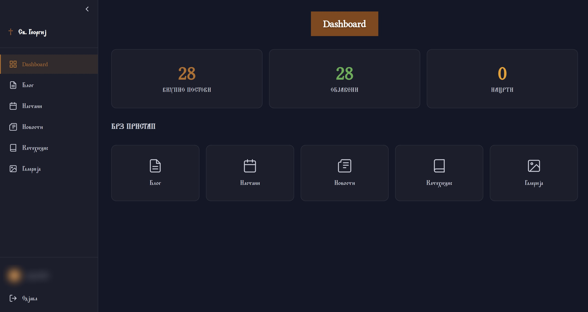
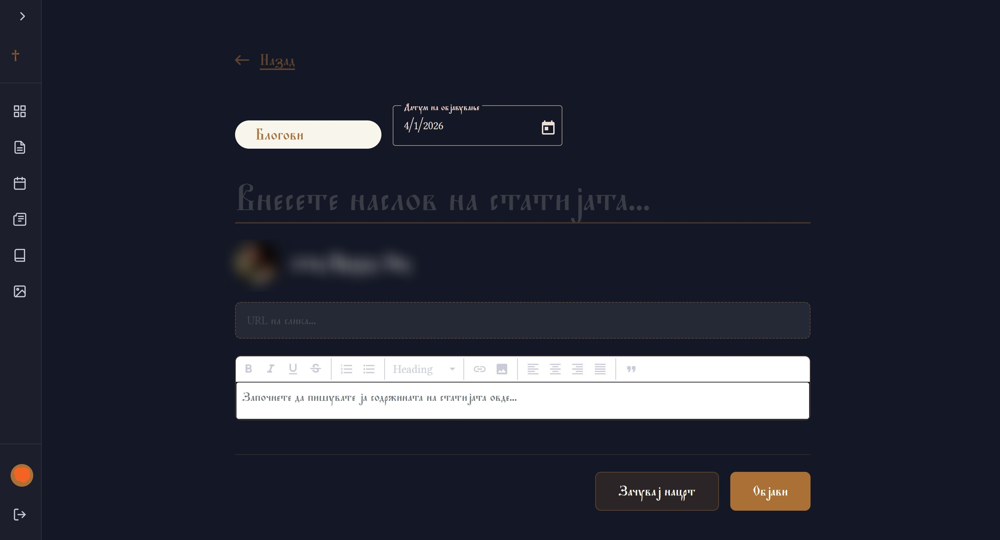
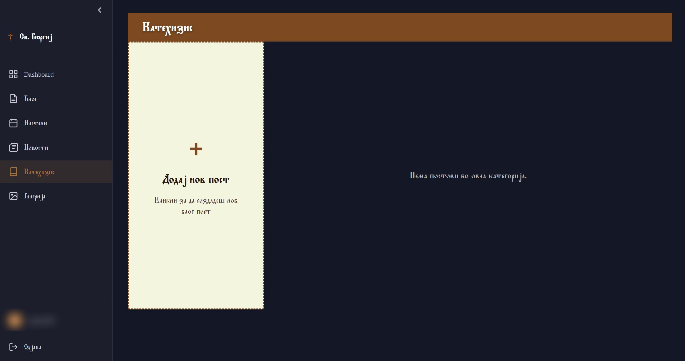
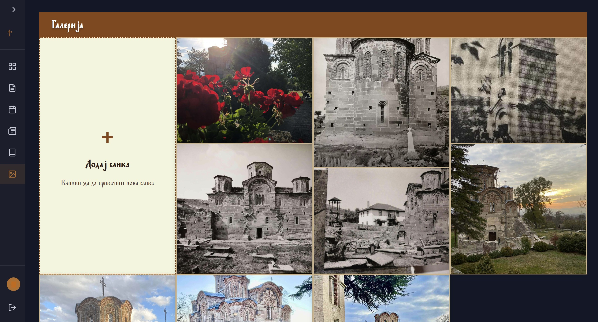

# Св. Георгиј - Старо Нагоричане

[](https://svgeorgij.mk)
[](https://angular.dev)
[](https://dotnet.microsoft.com)
[](https://www.typescriptlang.org)
[](https://www.microsoft.com/en-us/sql-server)
[](https://www.digitalocean.com)

> Full-stack production website for the Church of St. George (Св. Георгиј) at Staro Nagorichane monastery, Macedonia.

---

## Live Site

**[svgeorgij.mk](https://svgeorgij.mk)**

---

## Overview

A modern, responsive web platform built for a real Orthodox church client in Macedonia. The site serves as an information hub for the parish - featuring a liturgical calendar, blog/news posts, catechesis content, and a photo gallery - backed by a custom-built CMS admin panel for full content control.

The frontend is an Angular 20 SPA with Angular Material and Tailwind CSS. The REST API is built with ASP.NET Core 10, Entity Framework Core, and SQL Server 2022, secured with JWT authentication and refresh token rotation. The entire stack is deployed on DigitalOcean droplet with Nginx as a reverse proxy handling HTTPS via Let's Encrypt.

> **Note:** The backend (.NET API + SQL Server) lives in a **private repository** due to client confidentiality. This repo contains the Angular client only.

---


## Features

### Public Site
- **Homepage** - Hero section, church overview, featured calendar, and latest posts
- **Blog / News / Events / Catechesis** - Category-filtered post listings with rich content detail pages
- **Photo Gallery** - Image grid with modal lightbox preview
- **About the Church** - History and information about the monastery with optimized WebP images
- **Orthodox Liturgical Calendar** - Full calendar with fasting periods, saint day details, and today's feast display
- **Fully Localized** - Macedonian (Cyrillic) interface
- **Responsive** - Mobile-first design, works across all screen sizes

### Admin Panel (Protected)
- **Dashboard** - At-a-glance stats: published posts count, category breakdown, quick navigation
- **Post Management** - Create, edit, and delete posts with a rich text (ngx-editor) editor
- **Gallery Management** - Upload, preview, and delete church photos
- **Content Organization** - Posts organized by category (News, Events, Catechesis, etc.)
- **Secure Authentication** - JWT access tokens with automatic refresh token rotation
- **Role-Based Access Control** - Admin-only routes protected by Angular route guards

---

## Tech Stack

| Layer | Technology |
|---|---|
| **Frontend** | Angular 20, Angular Material, Tailwind CSS, TypeScript 5.9, RxJS 7, ngx-editor |
| **Backend** | ASP.NET Core 10, Entity Framework Core, SQL Server 2022, JWT Auth |
| **Infrastructure** | DigitalOcean (Ubuntu 24.04), Nginx (reverse proxy + auto-HTTPS), systemd |

---

## Admin Panel

<table>
  <tr>
    <td align="center">
      
      <br/><sub><b>Dashboard</b> - overview stats and quick navigation</sub>
    </td>
    <td align="center">
      
      <br/><sub><b>Post Editor</b> - ngx-editor with category and date picker</sub>
    </td>
  </tr>
  <tr>
    <td align="center">
      
      <br/><sub><b>Content Management</b> - posts list with edit and delete actions</sub>
    </td>
    <td align="center">
      
      <br/><sub><b>Gallery Management</b> - image upload and grid preview</sub>
    </td>
  </tr>
</table>

---

## Architecture

```
Client Browser (HTTPS 443)
        │
        ▼
┌───────────────────┐
│   Nginx (proxy)   │  - Auto-renewing Let's Encrypt TLS
└─────────┬─────────┘
          │
    ┌─────┴──────┐
    │            │
    ▼            ▼
Angular SPA    .NET API       ───►  SQL Server 2022
(static files)
```

All traffic is routed through a single domain (`svgeorgij.mk`). Nginx serves the pre-built Angular bundle from disk and proxies `/api/*` requests to the .NET application running as a systemd service.

---

## Project Structure

```
sv-georgij/
├── assets/                    # Admin panel screenshots (this README)
├── client/
│   └── sv-georgij-app/
│       ├── src/
│       │   └── app/
│       │       ├── core/      # Guards, interceptors, auth services
│       │       ├── features/
│       │       │   ├── admin/         # CMS dashboard, post editor, gallery
│       │       │   ├── auth/          # Login page
│       │       │   ├── calendar/      # Orthodox liturgical calendar
│       │       │   ├── content/       # Blog/news/post pages
│       │       │   └── home/          # Homepage sections
│       │       ├── layouts/           # Public layout wrapper
│       │       └── shared/            # Header, footer, UI primitives
│       └── package.json
└── server/                    # .NET 10 API - private repository
```

---

## Getting Started (Frontend)

> Requires **Node.js 22+** and the **Angular CLI** (`npm install -g @angular/cli`).

```bash
# Clone the repository
git clone https://github.com/your-username/sv-georgij.git
cd sv-georgij/client/sv-georgij-app

# Install dependencies
npm install

# Start the development server
ng serve

# Open http://localhost:4200
```

> The frontend expects the .NET API to be running and accessible. Without the backend, API-dependent features (posts, gallery, auth) will not function. The backend is available as a separate private repository.

---

## Deployment

The production stack runs on a **DigitalOcean Droplet** (Ubuntu 24.04 LTS):

- Angular app is built with `ng build` and served as static files
- .NET API runs as a `systemd` service
- **Nginx** handles reverse proxying, HTTPS termination, and automatic certificate renewal via Let's Encrypt (Certbot)
- Domain managed via **svgeorgij.mk**

---

## License

This project was built for a private client. All rights reserved. The code is shared publicly for portfolio purposes only - please do not use it commercially.
